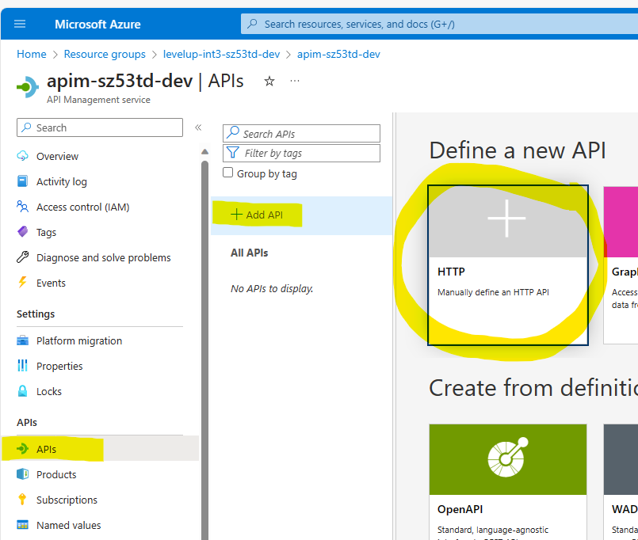
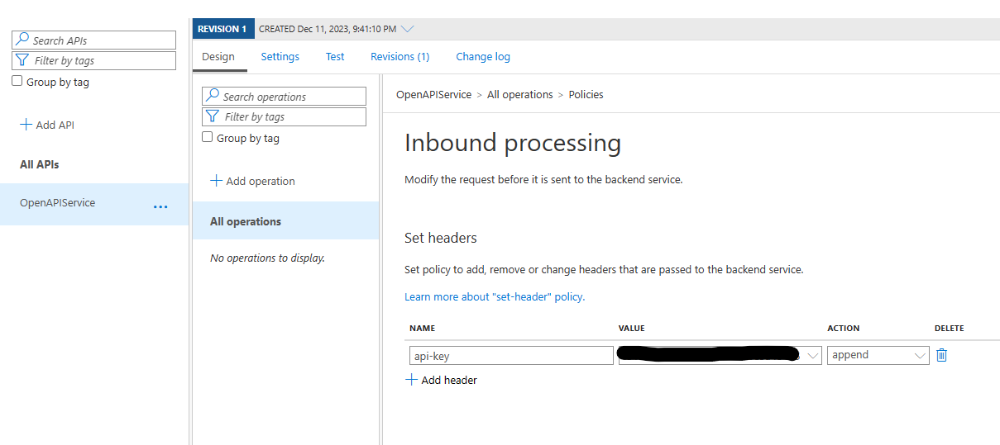
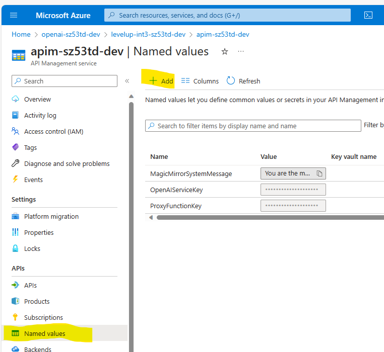

# Workshop - Using Azure API Management to manage an OpenAI API
In this workshop, you play the role of an architect who is responding to a request from the business to build an advanced chatbot experience to drive engagement and awareness about the company's products and capabilities.  The business has already selected OpenAI as the AI engine to power the chatbot.  Your job is to build the infrastructure to support the chatbot and ensure it can scale to meet the expected demand.

## Getting started
### Deploying the infrastructure
First things first, you need to clone this repo to your local machine and deploy the infrastructure.  Infrastructure templates have been provided for your convinience and can be found in the ```infra``` folder.  After cloning the repo, open a terminal window and navigate to the ```infra``` folder.  From there, run the following commands:

```az deployment sub create --location eastus --template-file main.bicep```

The deployment process should take about 5 minutes to 10 minutes to complete.  This will deploy the following resources:
- Azure Function App
- Azure Function App Plan
- Azure Application Insights
- Azure API Management
- Azure OpenAI
- Azure Key Vault
- Azure Log Analytics Workspace

### Deploying the function
Once the infrastructure has been deployed, you need to deploy the function.  The function is responsible for proxying requests to OpenAI so that we can simulate 429 responses.

create a local.settings.json file in the ```src\ProxyOpenAIEndpoint`` folder and copy the following into it:

```json
{
  "IsEncrypted": false,
  "Values": {
    "AzureWebJobsStorage": "",
    "FUNCTIONS_WORKER_RUNTIME": "dotnet-isolated",
    "OpenAIEndpoint": "<OpenAI Endpoint>",
    "OpenAIKey": "<OpenAI Key>"
  }
}
```

To deploy the function, run the following command from the ```src\ProxyOpenAIEndpoint``` folder:

```func azure functionapp publish <function app name>```

After the function is deployed, you need to fetch the Open AI Service Keys and Endpoint information to configure the function.

## Scenario 1
The business is intending to promote their capabilities by creating a magic mirror chat bot experience.  The idea is to let customers ask questions about anything that may come to mind and respond as if it were the magic mirror from the classic movie Snow White and the 7 Dwarfs.  While you are focused on the API, it needs to be kept in mind that the UI for the experience will be built for multiple different platforms and clients.  The API needs to be flexible enough to support the different UIs.

### Task 1 - Deploy the Open AI Model
First we need to deploy a model to our Open AI service.  Click on the Azure OpenAI resource in resource group we just provisioned.  Then click on 'Model Deployments'


Click on 'Manage Deployments'


This will open the Azure AI Studio.  Click on 'Create new deployment'


Select the gpt-35-turbo model, set it to auto-update, and name it the 'PrimaryModel'


Note the name of your model deployment.  We will need this later.


### Task 2 - Create the API
Now that we have a model deployed, we need to create an API to expose the model.  To do this, we will create an API in APIM that will proxy the requests to the OpenAI service, add some policies to inject the necessary keys for the backend service as well as transform the message to the format expected by the backend service.  To start, we need to add a new API to APIM.  To do this, click on the APIM resource in the resource group we just provisioned.  Then click on 'APIs, then click on '+ Add API', then select to manually defin an HTTP API.



When the create API dialog opens, enter the following information:

|Field|Value|
|-----|-----|
|Display Name:| OpenAPIService|
|name:| OpenAPIService|
|Web service URL:| https://[function App Name].azurewebsites.net/api/openai/deployments/[Model Deployment Name 'PrimaryModel']/chat/completions|
|API URL Suffix:| [leave blank]|


### Task 3 - Pass in the OpenAI and Function Keys
We need to authenticate against the backend system.  To do this, we need to use APIM policies to modify the requests that are made to the backend system.  In our case, we need to have two keys, one for the OpenAI Service and another for the Function (which is being used to help us simulate 429 responses for a later scenario).

We are going to add the keys to all operations.  To do this, click on the 'All operations' link under the 'OpenAPIService' API.  Then click on the 'Inbound processing' tab.  Then click on '+ Add policy'.


Select the 'set-header' policy.


Add a header called 'api-key' and the set the value as the OpenAI key.  Then save.



We need to now take care of the function key.  This key is a query string parameter.  We now need to add the Set-Query policy to our inbound policy for all operations.


Add a query string parameter 'code' with the value of your function key and save.


### Task 4 - Add an Operation
Now that we have the API setup, we need to add an operation to the API.  To do this, click on the 'OpenAPIService' API.  Then click on '+ Add operation'.  Then enter the following information:

|Field|Value|
|-----|-----|
|Display Name:| Chat|
|Name:| Chat|
|URL:| POST /|


### Task 5 - Transform the Request
Now that we have the operation setup, we need to add a policy to transform the request.  To do this, click on the 'Chat' operation.  Then click on the 'Inbound processing' tab.  Then click on '</>' to edit the policy code.


Copy and past the following policy code into the policy editor under \<policies\>\<inbound\>\<base/\>

```xml

        <set-body template="liquid">
            {
            "messages": [
                {
                "role": "system",
                "content": "You are a magic mirror, always be respectful to your mistress"
                },
                    {
                "role": "user",
                "content": "{{body.usercontent}}"
                }
            ],
            "temperature": 0.7,
            "top_p": 0.95,
            "frequency_penalty": 0,
            "presence_penalty": 0,
            "max_tokens": 800,
            "stop": null
            }
        </set-body>
```

When done, your policy should look like this:


>Note the {{body.usercontent}}.  This is a liquid template that will pull the user content from the request body and inject it into the request body for the backend service.  body is the json object that is passed in the request body.  usercontent is the property on the body object that we want to pull.  This is the property that will hold the user's question.

At this point, the API will work.  If you want to test the API, you can use the test option in the APIM portal.  Here is a sample body to use:

```json
{
    "usercontent": "What were the origional 13 US states?"
}
```


### Task 6 - Leverage Named Values
While everything is working, the API Keys and the OpenAI system message are hard coded in our policies.  We need to secure our keys and make the system message configurable.  To do this, we will leverage named values.  

We are going to create three named values:

|Name|Value|Secret|
|----|-----|------|
|MagicMirrorSystemMessage|You are the magic mirror from Snow White and the 7 dwarfs, you should act and sound like the magic mirror in all responses.  Always answer with a poem and always call me your majesty|No|
|OpenAIKey|\<OpenAI Key>|Yes|
|ProxyFunctionKey|\<Function Key>|Yes|

When done, your named values should look like this: 


Now we need to modify our policies to use the named values in place of our hard coded values.  We need to modify the inbound policy for all operations to use named values for our api keys and we need to modify the inbound policy for our operation to use the system message named value in our transformation.

Your all operations inbound policy should look like this:


Your operation inbound policy should look like this:


Test your API again to ensure it is still working... it should be.

### Task 7 - Add a Product and Subscription
Now that we have our API setup, we need to create a product and subscription.  To do this, click on the 'Products' link under the 'OpenAPIService' API.  Then click on '+ Add product'.  


Then enter the following information:


Now lets create a subscription to the product.  To do this, click on the product, then click on subscriptions and finally click on '+ add subscription'.


You will be presented with a dialog asking you for the subscription name and display name.


With your subscription created, you now need to copy the subscription key and use it when you call your API.  To do this, click on the subscription, then click on 'Show/hide keys'.


Let's test from an external client such as postman.  You need to setup a POST call to your APIM url.  Set the body to the following:

```json
{
    "usercontent": "What were the origional 13 US states?"
}
```
and add the subscription key to the header as 'Ocp-Apim-Subscription-Key'.


When you post your request, your response will retrun an answer that sounds something like the response a magic mirror would give you.  Feel free to plan around with the system message by updated the named value and testing again.

## Scenario 2
The Magic Mirror experience has been a wild success, now the business would like to create a Zoltar chat bot experience.  The idea is to let customers ask questions about anything that may come to mind and respond as if it were the Zoltar machine from the classic movie Big.  While you are focused on the API, it needs to be kept in mind that the UI for the experience will be built for multiple different platforms and clients.  The API needs to be flexible enough to support the different UIs.

### Task 1 - Create the product
Since the model has already been deployed, we can leverage the same model for the Zoltar experience.  First up, we will create a product for the Zoltar experience.  Go to the APIM resource and click on 'Products'.  Then click on '+ Add product'.  


Then enter the following information:

|Field|Value|
|-----|-----|
|Display Name:| Zoltar|
|Id:| Zoltar|
|Description:| This product will respond as if is the Zoltar Machine|
|Subscription required:| Yes|
|State:| Published|
|APIs:| OpenAPIService|


### Task 2 - create the 'Named Value' for the system message
Click on Named Values and then click on '+ Add named value'.  



Then enter the following information:

|Field|Value|
|-----|-----|
|Name:| ZoltarSystemMessage|
|Display Name:| ZoltarSystemMessage|
|Value:| You are the machine ZOLTAR from the movie big.  You answer peoples questions and wishes.  Your answers should be short and simple, something that would fit on a small card.|


When done, you should have the following:


### Task 3 - Refactor the Policy to support both Products
Next, we need to refactor the API to support both products.  To do this, we will modify the inbound policy on the chat operation to inspect the context and determine which product is being called.  If the Zoltar product is being called, we will use the Zoltar system message, otherwise we will use the Magic Mirror system message.  To do this, click on the 'Chat' operation.  Then click on the 'Inbound processing' tab.  Then click on '</>' to edit the policy code.


Replace the policy code with the following xml:

```xml
<policies>
    <inbound>
        <base />
        <choose>
            <when condition="@(context.Product.Id.Equals("magic-mirror"))">
                <set-body template="liquid">
                    {
                    "messages": [
                        {
                        "role": "system",
                        "content": "{{MagicMirrorSystemMessage}}"
                        },
                            {
                        "role": "user",
                        "content": "{{body.usercontent}}"
                        }
                    ],
                    "temperature": 0.7,
                    "top_p": 0.95,
                    "frequency_penalty": 0,
                    "presence_penalty": 0,
                    "max_tokens": 800,
                    "stop": null
                    }
                </set-body>
            </when>
            <when condition="@(context.Product.Id.Equals("zoltar"))">
                <set-body template="liquid">
                    {
                    "messages": [
                        {
                        "role": "system",
                        "content": "{{ZoltarSystemMessage}}"
                        },
                            {
                        "role": "user",
                        "content": "{{body.usercontent}}"
                        }
                    ],
                    "temperature": 0.7,
                    "top_p": 0.95,
                    "frequency_penalty": 0,
                    "presence_penalty": 0,
                    "max_tokens": 800,
                    "stop": null
                    }
                </set-body>
            </when>
        </choose>
    </inbound>
    <backend>
        <base />
    </backend>
    <outbound>
        <base />
    </outbound>
    <on-error>
        <base />
    </on-error>
</policies>
```

When complete, your policy should look like this:


### Task 4 - Subscribe to the Zoltar Product
In case you want to call the service from postman, you will need to subscribe to the Zoltar product.  To do this, click on the 'Zoltar' product.  Then click on subscriptions and finally click on '+ add subscription'.


You will want to copy the subscription key and use it when you call your API.  To do this, click on the subscription, then click on 'Show/hide keys'.


### Task 5 - Test the APIs
Using the portals test feature, test the API using the Magic Mirror product and the Zoltar product.  You should see different responses based on the product you are using.  Make sure to select the appropriate product when testing as it defaults to none, and make sure to set the content type to application/json.


## Scenario 3
Well... that didn't last long.  The campaign has been wildly successful and the business is now seeing a huge spike in traffic.  This is causing the OpenAI service to be throttled and return 429 respsponses.  The business is not happy and is demanding that you fix the problem immediately as they are getting negative feedback from customers.

### Task 1 - Deploy a new OpenAI Model
The first thing we need to do is deploy a new model.  To do this, click on the Azure OpenAI resource in resource group.  Then click on 'Model Deployments'

>Note: we are using the same openAI service, but we could use a different service if we wanted to.

>Note: we are not going to use the proxy function for the fail over model so the url will be slightly different.

- Image of model deployment

- Sample url

### Task 2 - Refactor the backend service to failover

- add the backend policy

- explain why we need to add the query string parameter for api version

### Task 3 - Test the failover

- First verify it still works as expected

- modify the function config to generate 429 responses

- test again and using the trace capabilities in APIM, show that it is failing over

